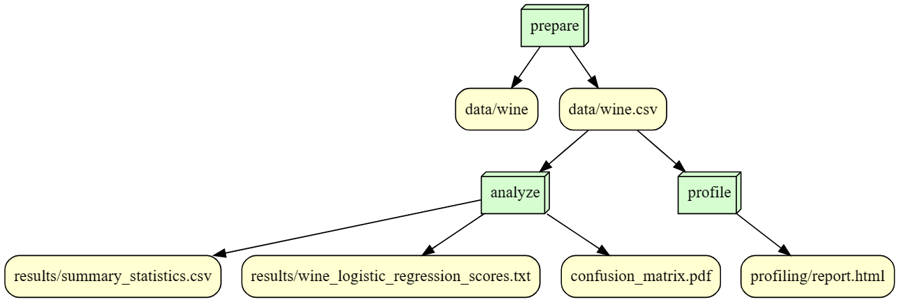

# IS477-FALL2023-FINAL-PROJECT - Exploration of the Wine Dataset from UCI repository

## Overview 
This repository is created for the Final Assignment for the course IS477. Here we take the [wine dataset](https://archive.ics.uci.edu/dataset/109/wine) which is found on the UCI Machine Learning Repository under the [CC-BY-4.0 license](https://creativecommons.org/licenses/by/4.0/legalcode). The dataset has been created by Stefan Aeberhard and M. Forina. The dataset contains the results of a chemical analysis of wines grown in a region in Italy, derived from three different cultivars. The dataset consists of 13 constituents found in each of the three types of wines as attributes. There are 178 instances in the dataset. This dataset was first used in the paper [Aeberhard, S., Coomans, D., & Vel, O.Y. (1994). Comparative analysis of statistical pattern recognition methods in high dimensional settings. Pattern Recognit., 27, 1065-1077.](https://www.semanticscholar.org/paper/Comparative-analysis-of-statistical-pattern-methods-Aeberhard-Coomans/83dc3e4030d7b9fbdbb4bde03ce12ab70ca10528). In this project, a Logistic Regression classification model is run on the dataset, with the 'Class' variable as the target. This variable stores the type of wine and there are 3 classes of wines in this dataset. Initially a preliminary exploratory data analysis is run on the dataset. The performance of the model is judged using Accuracy Score (94.4%) and F1-Score (0.945). The confusion matrix resulting from the classification task is visualized using a heatmap. The results of the exploratory data analysis, performance of the classification model and the visualization of the confusion matrix is stored in the _Results_ folder in this repository.     

## Analysis
A classification task was performed on the dataset for prediction of classes of wine (target variable). On performing a Logistic Regression classification on the dataset, it gave an accuracy of 94.4% and a 0.945 F1-score. According to the confusion matrix, the model calculated 17, 21, 13 true positives for classes 1, 2, and 3 of wine respectively. 

## Workflow 
The workflow of the data preparation, profiling and analysis was built using SnakeMake. 

## Reproducing
_Operating System_   
Microsoft Windows [Version 10.0.19045.3693] 

_Python Specification_   
Python 3.10   
Pip 23.2.1 

_Python Dependencies_   
annotated-types==0.6.0  
attrs==23.1.0  
certifi==2023.11.17  
charset-normalizer==3.3.2  
colorama==0.4.6  
contourpy==1.2.0  
cycler==0.12.1  
dacite==1.8.1  
fonttools==4.44.3  
htmlmin==0.1.12  
idna==3.4  
ImageHash==4.3.1  
Jinja2==3.1.2  
joblib==1.3.2  
kiwisolver==1.4.5  
llvmlite==0.41.1  
MarkupSafe==2.1.3  
matplotlib==3.7.3  
multimethod==1.10  
networkx==3.2.1  
numba==0.58.1  
numpy==1.25.2  
packaging==23.2  
pandas==2.0.3  
patsy==0.5.3  
phik==0.12.3  
Pillow==10.1.0  
pydantic==2.5.1  
pydantic_core==2.14.3  
pyparsing==3.1.1  
python-dateutil==2.8.2  
pytz==2023.3.post1  
PyWavelets==1.5.0  
PyYAML==6.0.1  
requests==2.31.0  
scikit-learn==1.3.2  
scipy==1.11.4  
seaborn==0.12.2  
six==1.16.0  
statsmodels==0.14.0  
tangled-up-in-unicode==0.2.0  
threadpoolctl==3.2.0  
tqdm==4.66.1  
typeguard==4.1.5  
typing_extensions==4.8.0  
tzdata==2023.3  
urllib3==2.1.0  
visions==0.7.5  
wordcloud==1.9.2  
ydata-profiling==4.6.1  

_Steps to reproduce the results_
1. Clone this repository   
2. If you have Docker installed, run the following commands in the windows terminal:  
   a. docker run –-rm -v %cd%:/is477 puranjani02/is477-fall2023:assignment2 python scripts/prepare_data.py  
   b. docker run –-rm -v %cd%:/is477 puranjani02/is477-fall2023:assignment2 python scripts/profile.py  
   c. docker run –-rm -v %cd%:/is477 puranjani02/is477-fall2023:assignment2 python scripts/analysis.py  
    _if running in MacOS replace %cd% by ${PWD}_  
    
## License
This repository is licensed under [GNU GPLv3 license](https://www.gnu.org/licenses/gpl-3.0.en.html). This is a copyleft FOSS license. It allows commercial use, distribution, modification, patent use and private use. This will allow the work to be distributed and modified in future. This is a step towards making the work transparent in future. This will allow this work to be reproduced and modified in future. The GPLv3 license also enforces that the source of the work be mentioned, along with license and copyright notice. This license also conditions the next works to be under the same GPLv3 license, ensuring transparency for all of them. Also, modified works on this study will have to mention the changes done from the original work explicitly. 

## References
1. Aeberhard,Stefan and Forina,M.. (1991). Wine. UCI Machine Learning Repository. [https://doi.org/10.24432/C5PC7J](https://doi.org/10.24432/C5PC7J).

